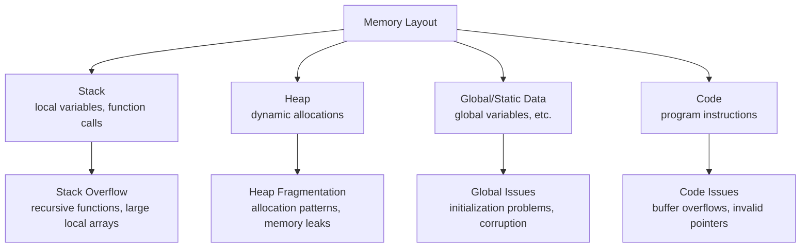
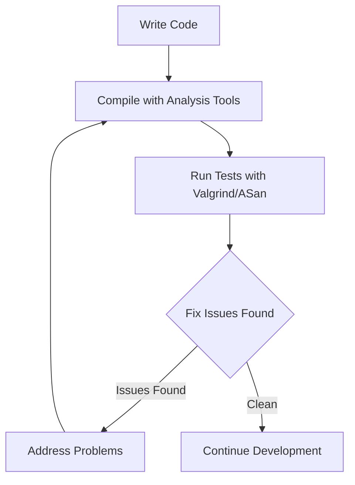

---
tags:
  - 嵌入式
  - 调试
  - 内存
source: "Advanced_Hardware/Advanced_Analysis_Tools.md"
created: 2026-08-27
---

> ## 🚀 在 EmbeddedInterviewLab 上练习与深入钻研
>
> 学习这些高级硬件主题的交互式版本——按难度排序的面试题与深入指南。
>
> 👉 **[打开面试题库 →](https://embeddedinterviewlab.com/questions?utm_source=github&utm_medium=referral&utm_campaign=kb_cta&utm_content=advanced_hardware)** &nbsp;·&nbsp; **[阅读主题指南 →](https://embeddedinterviewlab.com/topics?utm_source=github&utm_medium=referral&utm_campaign=kb_cta&utm_content=advanced_hardware)**

---

# 高级分析工具 (Advanced Analysis Tools)

> **面向稳健嵌入式系统的深度代码分析**  
> 理解如何使用高级分析工具来查找缺陷并提升代码质量

---

## 📋 **目录**

- [🎯 快速概览](#quick-cap) - 这是什么，以及为什么面试官在意？
- [🔍 深入讲解](#deep-dive) - 你需要掌握的技术细节
- [💼 面试重点](#interview-focus) - 常见问题及如何作答
- [🧪 练习](#practice) - 用问题与场景检验你的知识
- [🏭 现实世界关联](#real-world-tie-in) - 这在实际嵌入式岗位中如何应用
- [✅ 清单](#checklist) - 你是否为该主题的面试做好准备？
- [📚 额外资源](#extra-resources) - 在哪里深入学习

---

## 🎯 快速概览

高级分析工具是专门的软件工具，能在缺陷进入生产环境之前发现嵌入式系统中的缺陷、内存问题和代码质量问题。嵌入式工程师之所以关心这些工具，是因为它们能捕获那些可能导致系统故障、安全漏洞或在资源受限环境中引发安全问题的关键缺陷。在汽车系统中，这些工具有助于防止那些可能导致制动系统失效或意外加速的软件缺陷。

## 🔍 深入讲解

### 🎯 **分析理念**

#### **为什么静态分析与动态分析很重要**

在嵌入式系统中，缺陷可能是灾难性的。一次简单的缓冲区溢出(buffer overflow)可能导致医疗设备故障，或汽车制动系统失效。分析工具帮助我们在这些问题进入生产环境之前捕获它们。

**分析思维**

分析的目的不在于发现每一个可能的缺陷——而在于发现最要紧的缺陷。重点关注：
- **安全漏洞(security vulnerabilities)**，可能被利用的漏洞
- **内存问题(memory issues)**，导致崩溃或数据损坏的问题
- **逻辑错误(logic errors)**，导致错误行为的问题
- **性能问题(performance problems)**，影响系统可靠性的问题

### 🔍 **静态分析工具**

#### **AddressSanitizer：内存错误检测**

AddressSanitizer (ASan) 就像有一位保安看守着每一次内存访问。它能检测：
- 缓冲区溢出(buffer overflows)
- 释放后使用(use-after-free)错误
- 重复释放(double-free)错误
- 内存泄漏(memory leaks)

#### **ASan 如何工作**

ASan 会在你的代码中添加插桩(instrumentation)，用于追踪内存的分配与访问：

```c
// 原始代码
void process_data(char* buffer, int size) {
    for (int i = 0; i <= size; i++) {  // 缺陷：应为 < 而不是 <=
        buffer[i] = 'A';  // 缓冲区溢出！
    }
}

// ASan 插桩后的代码（概念上）
void process_data(char* buffer, int size) {
    for (int i = 0; i <= size; i++) {
        if (i >= allocated_size) {
            report_error("Buffer overflow detected");
            return;
        }
        buffer[i] = 'A';
    }
}
```

#### **在实践中使用 ASan**

```bash
# 使用 AddressSanitizer 编译
gcc -fsanitize=address -g -O0 -o program program.c

# 运行程序
./program

# ASan 会报告类似这样的错误：
# ==12345== ERROR: AddressSanitizer: buffer overflow
# ==12345== WRITE of size 1 at 0x60200000eff8 thread T0
# ==12345== Address 0x60200000eff8 is located 0 bytes to the right of 10-byte region
```

### 🚀 **动态分析工具**

#### **Valgrind：全面的内存分析**

Valgrind 是动态分析领域的瑞士军刀(Swiss Army knife)。它能：
- 检测内存泄漏(memory leaks)
- 发现未初始化内存的使用
- 识别非法内存访问
- 分析内存使用模式

#### **内存泄漏检测**

```c
// 常见的内存泄漏模式
void create_sensor_data() {
    SensorData* data = malloc(sizeof(SensorData));
    if (data) {
        data->timestamp = get_current_time();
        data->value = read_sensor();
        
        // 处理数据...
        
        // 糟糕！我们忘了释放 data
        // 这会造成内存泄漏
    }
}
```

**Valgrind 输出：**
```
==12345== HEAP SUMMARY:
==12345==     in use at exit: 64 bytes in 1 blocks
==12345==   total heap usage: 1 allocs, 0 frees, 64 bytes allocated

==12345== 64 bytes in 1 blocks are definitely lost in loss record 1 of 1
==12345==    at 0x4C2AB80: malloc (in /usr/lib/valgrind/vgpreload_memcheck-amd64-linux.so)
==12345==    at 0x400544: create_sensor_data (main.c:15)
==12345==    at 0x4005A2: main (main.c:25)
```

#### **未初始化内存检测**

```c
// 未初始化内存的使用
void process_buffer(int* buffer, int size) {
    int sum = 0;
    for (int i = 0; i < size; i++) {
        sum += buffer[i];  // 读取未初始化内存！
    }
    printf("Sum: %d\n", sum);
}

int main() {
    int buffer[100];
    // 我们忘了初始化 buffer
    process_buffer(buffer, 100);
    return 0;
}
```

**Valgrind 输出：**
```
==12345== Conditional jump or move depends on uninitialised value(s)
==12345==    at 0x400544: process_buffer (main.c:15)
==12345==    at 0x4005A2: main (main.c:25)
```

### 🧠 **内存分析深入讲解**

#### **理解内存布局**

要理解内存问题，你需要知道内存是如何组织的：



#### **常见的内存问题**

**1. 栈溢出(Stack Overflow)**
```c
// 没有基准情形(base case)的递归函数
void infinite_recursion() {
    int local_var = 42;
    infinite_recursion();  // 栈不断增长直至溢出
}
```

**2. 堆碎片化(Heap Fragmentation)**
```c
// 以产生空洞的方式分配和释放内存
for (int i = 0; i < 1000; i++) {
    void* ptr1 = malloc(100);
    void* ptr2 = malloc(100);
    free(ptr1);  // 产生碎片化
    // ptr2 保持分配状态
}
```

**3. 释放后使用(Use After Free)**
```c
void* ptr = malloc(100);
free(ptr);
// ptr 现在是悬垂指针(dangling)
*((int*)ptr) = 42;  // 写入已释放的内存！
```

### 🛠️ **实际集成**

#### **在你的工作流中集成分析工具**

**开发工作流**



#### **Makefile 集成**

```makefile
# 分析目标
analyze: CFLAGS += -fsanitize=address -g -O0
analyze: program
	./program

valgrind: program
	valgrind --tool=memcheck --leak-check=full ./program

asan: CFLAGS += -fsanitize=address -g -O0
asan: program
	ASAN_OPTIONS=detect_leaks=1 ./program
```

#### **持续集成**

```yaml
# GitHub Actions 示例
name: Code Analysis
on: [push, pull_request]

jobs:
  analyze:
    runs-on: ubuntu-latest
    steps:
      - uses: actions/checkout@v2
      - name: Build with ASan
        run: |
          make CFLAGS="-fsanitize=address -g -O0"
      - name: Run with Valgrind
        run: |
          make valgrind
      - name: Run tests with ASan
        run: |
          make asan
```

### 常见陷阱与误解

<Callout>
**陷阱：忽视分析工具的警告**
许多开发者把分析工具的警告当作误报(false positives)而不予理会，但在嵌入式系统中，这些警告往往预示着可能导致现场故障的真实问题。

**误解：分析工具拖慢开发**
虽然分析工具会增加编译时间，但它们通过尽早捕获问题而节省了大量的调试时间。在搭建上投入的成本会以现场故障减少的形式带来丰厚回报。
</Callout>

### 性能 vs. 资源权衡

| 工具 | 性能影响 | 内存开销 | 检测能力 |
|------|-------------------|-----------------|-------------------|
| **AddressSanitizer** | 慢 2-3 倍 | 内存占用 2-3 倍 | 出色的内存错误检测 |
| **Valgrind** | 慢 10-20 倍 | 内存占用 2-4 倍 | 全面分析 |
| **静态分析器** | 影响极小 | 无运行时开销 | 适合代码质量问题 |

**嵌入式面试官想听到的是**：你理解分析工具对尽早捕获关键缺陷的重要性，你把它们集成到开发工作流中，并且你能解读它们的输出来修复实际问题，而不是把警告当作误报而不予理会。

## 💼 面试重点

### 经典嵌入式面试题

1. **"你如何在嵌入式系统中调试内存问题？"**
2. **"静态分析和动态分析有什么区别？"**
3. **"你会如何把分析工具集成到持续集成流水线中？"**
4. **"当分析工具报告一个你认为的误报时，你会怎么做？"**
5. **"你会如何为某个项目在不同分析工具之间做选择？"**

### 模型回答开头

1. **"我会在开发初期使用 AddressSanitizer 这样的静态分析工具尽早捕获内存错误，然后用 Valgrind 这样的动态工具做全面测试……"**
2. **"静态分析在不执行代码的情况下检查代码以发现潜在问题，而动态分析则运行代码并监测实际行为以发现运行时问题……"**
3. **"我通过 Makefile 目标和 CI/CD 流水线把分析工具集成到构建过程中，以确保每次代码改动都被自动分析……"**

### 陷阱提醒

- **陷阱**：把所有分析工具的警告都当作误报而不予理会
- **陷阱**：只使用一种分析工具，而不是多种互补工具
- **陷阱**：不了解分析工具在资源受限系统中的性能影响

## 🧪 练习

<Quiz>
**问题**：哪种分析工具对于检测只在特定时序条件下发生的缓冲区溢出最有效？

A) 仅静态分析
B) AddressSanitizer
C) Valgrind
D) 代码评审

**答案**：B) AddressSanitizer。虽然静态分析可能捕获明显的缓冲区溢出，但与时序相关的问题需要运行时分析。AddressSanitizer 提供出色的内存错误检测能力，且性能开销合理，非常适合捕获这类缺陷。
</Quiz>

### 编程任务
实现一个带适当边界检查的环形缓冲区(circular buffer)，并使用 AddressSanitizer 验证不存在内存错误：

```c
// 实现这个环形缓冲区结构
typedef struct {
    uint8_t* buffer;
    size_t size;
    size_t head;
    size_t tail;
    size_t count;
} CircularBuffer;

// 你的任务：
// 1. 实现 CircularBuffer_init()
// 2. 实现带边界检查的 CircularBuffer_push()
// 3. 实现带边界检查的 CircularBuffer_pop()
// 4. 用 AddressSanitizer 编译并测试边界条件
```

### 调试场景
你的嵌入式系统在运行数小时后出现间歇性崩溃。崩溃转储(crash dump)显示栈数据损坏。使用分析工具，你会如何着手调试这个问题？

### 系统设计题
为一个资源受限的嵌入式项目设计一个集成了多种分析工具的开发工作流，同时保持合理的构建时间。

## 🏭 现实世界关联

### 在嵌入式开发中
在特斯拉，分析工具对所有汽车软件都是强制性的。团队在开发和测试阶段使用 AddressSanitizer 来捕获可能影响车辆安全系统的内存错误。这种主动方法已预防了众多潜在的现场问题。

### 在生产线上
在医疗器械制造中，分析工具被集成到构建过程中，以确保每个固件版本都符合安全标准。一家领先的医疗器械公司通过 Valgrind 发现了一个关键的内存泄漏，该泄漏在长时间运行后会导致设备故障。

### 在整个行业中
航空航天行业要求将全面的代码分析作为 DO-178C 认证的一部分。分析工具通过在故障模式引发系统故障之前识别它们，帮助证明软件满足所需的安全等级。

## ✅ 清单

<Checklist>
- [ ] 理解静态分析 vs. 动态分析的区别
- [ ] 知道如何把 AddressSanitizer 集成到构建过程中
- [ ] 能够解读 Valgrind 输出并修复内存问题
- [ ] 在持续集成流水线中搭建分析工具
- [ ] 知道面对不同问题应使用哪些不同分析工具
- [ ] 理解分析工具的性能权衡
- [ ] 能够区分真实问题与误报
</Checklist>

## 📚 额外资源

### 推荐阅读

- **Brendan Gregg 的《Systems Performance》** - 系统性能分析的全面指南
- **Martin Thompson 的《Performance and Scalability》** - 性能工程原理
- **Raj Jain 的《The Art of Computer Systems Performance Analysis》** - 性能数据的统计分析

### 在线资源

- **perf-tools** - 性能分析工具合集
- **FlameGraph** - 火焰图(flame graph)生成工具
- **Valgrind 文档** - 全面的内存分析指南

### 练习

1. **剖析一个简单的排序算法** - 比较冒泡排序 vs. 快速排序
2. **查找内存泄漏** - 故意制造泄漏并用 Valgrind 找出它们
3. **优化矩阵乘法** - 使用 perf 识别缓存问题
4. **生成火焰图** - 剖析一个多线程应用

---

**下一主题**: [[Security_Fundamentals]] → [[Secure_Boot_Chain_Trust]]
