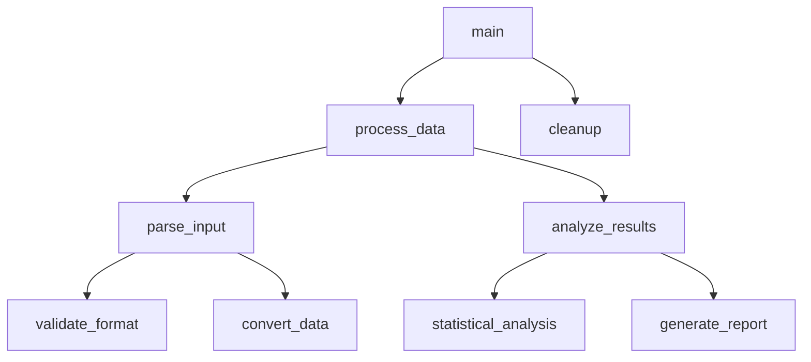
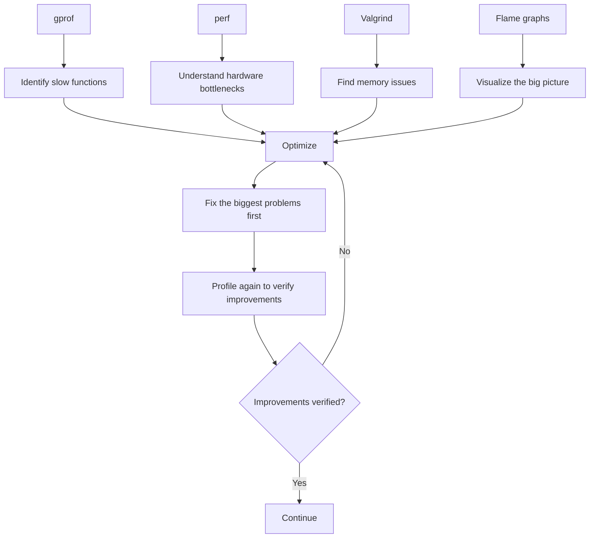

---
tags:
  - 嵌入式
  - 性能
  - 调试
source: "Advanced_Hardware/Advanced_Profiling_Tools.md"
created: 2026-08-27
---

> ## 🚀 在 EmbeddedInterviewLab 上练习与深入钻研
>
> 学习这些高级硬件主题的交互式版本——按难度排序的面试题与深入指南。
>
> 👉 **[打开面试题库 →](https://embeddedinterviewlab.com/questions?utm_source=github&utm_medium=referral&utm_campaign=kb_cta&utm_content=advanced_hardware)** &nbsp;·&nbsp; **[阅读主题指南 →](https://embeddedinterviewlab.com/topics?utm_source=github&utm_medium=referral&utm_campaign=kb_cta&utm_content=advanced_hardware)**

---

# 高级性能剖析工具 (Advanced Profiling Tools)

> **通过高级分析解锁性能洞察**  
> 理解如何使用性能剖析工具(profiling tools)识别瓶颈并优化嵌入式系统

---

## 📋 **目录**

- [🎯 快速概览](#quick-cap) - 这是什么，以及为什么面试官在意？
- [🔍 深入讲解](#deep-dive) - 你需要掌握的技术细节
- [💼 面试重点](#interview-focus) - 常见问题及如何作答
- [🧪 练习](#practice) - 用问题与场景检验你的知识
- [🏭 现实世界关联](#real-world-tie-in) - 这在实际嵌入式岗位中如何应用
- [✅ 清单](#checklist) - 你是否为该主题的面试做好准备？
- [📚 额外资源](#extra-resources) - 在哪里深入学习

---

## 🎯 快速概览

高级性能剖析工具是专门的软件工具，用于测量和分析系统性能，以识别嵌入式系统中的瓶颈、内存问题和优化机会。嵌入式工程师之所以关心这些工具，是因为它们揭示了在资源受限硬件上运行的代码的真实性能特征，从而帮助优化功耗、实时要求和系统可靠性。在汽车系统中，性能剖析工具有助于确保关键安全功能满足严格的时序要求，且不超出内存预算。

## 🔍 深入讲解

### 🎯 **性能剖析理念**

#### **什么是性能剖析，为什么它很重要？**

性能剖析(profiling)是测量你的系统在实践中实际表现如何的艺术与科学，而不是你"认为它应该"表现如何。可以把它想像成把你的系统置于显微镜下，精确地看待时间和资源被花在了哪里。

**性能悖论(The Performance Paradox)**

大多数开发者都经历过这种情况：你写下了自认为高效的代码，但系统依然运行缓慢。这是因为：

- **直觉常常是错误的**，关于性能瓶颈实际出现在哪里
- **现代系统很复杂**，具有多层抽象
- **性能特征会变化**，随着数据规模和使用模式的演进
- **硬件行为不可预测**，由于缓存、流水线(pipelining)和其他优化

**性能剖析思维**

性能剖析的目的不在于让代码更快——而在于理解实际发生了什么。这种理解会带来更好的设计决策、更有针对性的优化，并最终造就更好的系统。

### 🔍 **函数级性能剖析**

#### **gprof：经典的函数性能剖析器**

gprof 就像给程序里的每个函数配了一块秒表。它不只告诉你每个函数耗时多久，还告诉你它被调用了多少次，以及它与其他函数的关系。

#### **gprof 如何工作：采样法**

想像你在尝试通过每隔几秒拍快照来理解一家工厂是如何运转的。gprof 做了类似的事：

```
Time 1: Function A is running
Time 2: Function A is still running  
Time 3: Function B is running
Time 4: Function A is running again
```

通过每秒采样几千次，gprof 构建出一幅关于你程序时间花费在何处的统计图景。

#### **理解 gprof 输出**

当你运行 gprof 时，会得到类似这样的输出：

```
%   cumulative   self              self     total           
time   seconds   seconds    calls  ms/call  ms/call  name    
75.0      0.15     0.15     1000     0.15     0.20  process_data
20.0      0.19     0.04     5000     0.01     0.01  helper_function
 5.0      0.20     0.01        1    10.00    10.00  main
```

**这告诉了你什么：**

- **`process_data`** 占用了程序 75% 的时间
- 它被调用 1000 次，每次耗时 0.15ms
- 总时间包含对其他函数的调用（总计 0.20ms）
- **`helper_function`** 被调用 5000 次但只占 20% 的时间
- **`main`** 直接花费的时间很少

#### **gprof 实际示例**

假设你正在剖析一个嵌入式图像处理系统：

```c
// 优化前 - gprof 显示它占 80% 的时间
void process_image(uint8_t* image, int width, int height) {
    for (int y = 0; y < height; y++) {
        for (int x = 0; x < width; x++) {
            // 这个内层循环是瓶颈
            image[y * width + x] = apply_filter(image[y * width + x]);
        }
    }
}

// 优化后 - gprof 显示时间减少 60%
void process_image_optimized(uint8_t* image, int width, int height) {
    // 使用 SIMD 一次处理多个像素
    // 缓存友好的内存访问模式
    // 降低函数调用开销
}
```

**关键洞察：** gprof 揭示了嵌套循环结构才是真正的问题，而不是 `apply_filter` 函数本身。

### 📊 **内存性能剖析**

#### **Valgrind：内存侦探**

Valgrind 就像为你的内存使用配备了一名法医调查员。它能检测内存泄漏、缓冲区溢出，以及其他臭名昭著难以发现的内存相关缺陷。

#### **内存性能剖析如何工作**

内存性能剖析与时序性能剖析有本质区别，因为内存问题往往不会立即显现。可以把它想成水箱里的缓慢泄漏：

```
Time 0:   Tank has 1000L, usage is normal
Time 1:   Tank has 999L, still normal
Time 2:   Tank has 998L, still normal
...
Time 100: Tank has 900L, now we notice the problem
```

#### **嵌入式系统中的常见内存问题**

**1. 长时间运行系统中的内存泄漏**

```c
// 这段代码看起来无害，却会导致内存泄漏
void process_sensor_data() {
    SensorData* data = malloc(sizeof(SensorData));
    if (data) {
        // 处理数据...
        // 糟糕！我们忘了 free(data)
        // 调用 1000 次之后，我们丢失了 1000 * sizeof(SensorData) 字节
    }
}
```

**2. 受限环境中的缓冲区溢出**

```c
// 随时可能发生的缓冲区溢出
void copy_string(char* dest, const char* src) {
    int i = 0;
    while (src[i] != '\0') {
        dest[i] = src[i];  // 没有边界检查！
        i++;
    }
    dest[i] = '\0';
}

// 导致溢出的用法
char small_buffer[10];
copy_string(small_buffer, "This string is way too long for the buffer");
```

#### **Valgrind 输出解读**

Valgrind 输出看起来吓人，但其实遵循清晰的模式：

```
==12345== HEAP SUMMARY:
==12345==     in use at exit: 1,024 bytes in 1 blocks
==12345==   total heap usage: 1,000 allocs, 999 frees, 1,024 bytes allocated
==12345== 
==12345== 1,024 bytes in 1 blocks are definitely lost in loss record 1 of 1
==12345==    at 0x4C2AB80: malloc (in /usr/lib/valgrind/vgpreload_memcheck-amd64-linux.so)
==12345==    at 0x400544: process_sensor_data (main.c:15)
==12345==    at 0x4005A2: main (main.c:25)
```

**这告诉了你什么：**

- **1,024 字节确定丢失**（内存泄漏）
- **1,000 次分配**但只有 **999 次释放**
- 泄漏发生在 `main.c` 第 15 行的 `process_sensor_data()`
- 该泄漏由第 25 行的 `main()` 调用

### 🚀 **系统级性能剖析**

#### **perf：Linux 性能瑞士军刀**

perf 就像为你的整个系统配备了一套高科技诊断套件。它可以剖析 CPU 使用率、缓存未命中(cache misses)、分支预测(branch predictions)，乃至硬件事件。

#### **理解硬件事件**

现代处理器拥有数以百计的性能计数器，追踪从缓存命中到分支预测失败的各种事件。perf 让你访问这些计数器。

**关键硬件事件：**

```
cpu-cycles          - Total CPU cycles
cache-misses        - Cache misses at all levels
branch-misses       - Branch prediction failures
page-faults         - Memory page faults
context-switches    - Operating system context switches
```

#### **perf 实战：一个真实示例**

假设你正在优化一个矩阵乘法算法：

```bash
# 剖析程序，看缓存未命中发生在哪里
perf record -e cache-misses ./matrix_multiply
perf report
```

**示例输出：**
```
# Overhead  Command          Shared Object      Symbol
# ........  .......  .................  ................
  45.23%  matrix_multiply  matrix_multiply    [.] multiply_row_col
  32.15%  matrix_multiply  matrix_multiply    [.] access_matrix_element
  22.62%  matrix_multiply  matrix_multiply    [.] main
```

**这揭示了什么：**

- **`multiply_row_col`** 缓存未命中最多（45.23%）
- **`access_matrix_element`** 也有显著的缓存问题（32.15%）
- 问题很可能是糟糕的内存访问模式

#### **缓存感知优化**

优化前（缓存不友好）：
```c
// 这会导致大量缓存未命中
for (int i = 0; i < N; i++) {
    for (int j = 0; j < N; j++) {
        for (int k = 0; k < N; k++) {
            C[i][j] += A[i][k] * B[k][j];  // 糟糕的内存局部性
        }
    }
}
```

优化后（缓存友好）：
```c
// 这会最小化缓存未命中
for (int i = 0; i < N; i++) {
    for (int k = 0; k < N; k++) {
        for (int j = 0; j < N; j++) {
            C[i][j] += A[i][k] * B[k][j];  // 更好的内存局部性
        }
    }
}
```

**为什么有效：** 优化后的版本以更连续的顺序访问内存，从而减少缓存未命中。

### 🔥 **火焰图：可视化性能**

#### **什么是火焰图？**

火焰图(flame graphs)就像你程序执行的热力图(heat maps)。它们精确地展示时间花在了哪里，最耗时的函数显示为最宽的条。

#### **阅读火焰图**



**如何阅读：**

- **宽度 = 时间**：越宽的条代表花费的时间越多
- **高度 = 调用栈**：越高的条表示调用链越深
- **从左到右**：展示函数调用的顺序
- **从下到上**：展示调用栈深度

#### **用 perf 生成火焰图**

```bash
# 录制性能数据
perf record -g ./your_program

# 生成火焰图
perf script | stackcollapse-perf.pl | flamegraph.pl > flamegraph.svg
```

#### **解读火焰图模式**

**1. 宽的底部条 = 主要瓶颈**
```
main() ############################################################
├── expensive_function() ########################################
```
这表明 `expensive_function` 是你主要的性能问题。

**2. 高而窄的条 = 深度调用链**
```
main() #
├── a() #
│   ├── b() #
│   │   ├── c() #
│   │   │   ├── d() #
│   │   │   │   └── e() ########################################
```
这表明 `e()` 通过一条深层调用链被调用，并占据了大部分时间。

**3. 多个宽条 = 多个瓶颈**
```
main() ############################################################
├── function_a() ########################
├── function_b() ########################
└── function_c() ########################
```
这表明你有三个大致相等的性能瓶颈。

### 🛠️ **高级分析技术**

#### **组合多种工具**

真正的威力来自把多种性能剖析工具一起使用。每种工具都给你对同一问题的不同视角。

#### **性能剖析工作流**



#### **真实示例：优化一个图像滤波器**

假设你正在优化一个太慢的图像滤波器：

**步骤 1：gprof 分析**
```bash
gprof ./image_filter gmon.out > analysis.txt
```

**结果：** `apply_filter()` 占 80% 的时间

**步骤 2：perf 分析**
```bash
perf record -e cache-misses ./image_filter
perf report
```

**结果：** 滤波器循环中缓存未命中率很高

**步骤 3：内存分析**
```bash
valgrind --tool=memcheck ./image_filter
```

**结果：** 没有内存泄漏，但有一些缓冲区越界

**步骤 4：生成火焰图**
```bash
perf script | stackcollapse-perf.pl | flamegraph.pl > filter_flame.svg
```

**结果：** 直观确认滤波器循环就是瓶颈

**步骤 5：优化**
```c
// 优化前：简单但慢
for (int i = 0; i < size; i++) {
    output[i] = apply_filter(input[i]);
}

// 优化后：SIMD 优化且缓存友好
for (int i = 0; i < size; i += 4) {
    // 使用 SIMD 一次处理 4 个像素
    // 以缓存友好的模式访问内存
}
```

**步骤 6：验证改进**
```bash
gprof ./image_filter_optimized gmon.out > analysis_after.txt
```

**结果：** `apply_filter()` 现在只占 30% 的时间

### 📈 **实用工作流**

#### **日常开发工作流**

**早晨例行：**
1. 启用性能剖析来运行你的测试套件
2. 检查是否有新的性能回退
3. 在长时间运行测试中查找内存泄漏

**开发期间：**
1. 在你实现新功能时就进行性能剖析
2. 使用火焰图理解性能特征
3. 在优化前后分别进行性能剖析

**发布前：**
1. 在目标硬件上进行全面的性能剖析
2. 用 Valgrind 做内存泄漏检测
3. 性能回退测试

#### **性能回退检测**

```bash
#!/bin/bash
# 自动化的性能回退检测

# 基线性能
echo "Running baseline performance test..."
perf stat -o baseline.txt ./your_program

# 当前性能  
echo "Running current performance test..."
perf stat -o current.txt ./your_program

# 比较结果
echo "Performance comparison:"
diff baseline.txt current.txt

# 检查是否有显著回退
# （你可以在这里添加阈值）
```

#### **CI/CD 中的持续性能剖析**

```yaml
# 示例 GitHub Actions 工作流
name: Performance Testing
on: [push, pull_request]

jobs:
  profile:
    runs-on: ubuntu-latest
    steps:
      - uses: actions/checkout@v2
      - name: Build with profiling
        run: |
          make CFLAGS="-pg -O2"
      - name: Run performance tests
        run: |
          ./run_performance_tests.sh
      - name: Generate flame graphs
        run: |
          perf record -g ./your_program
          perf script | stackcollapse-perf.pl | flamegraph.pl > flamegraph.svg
      - name: Upload artifacts
        uses: actions/upload-artifact@v2
        with:
          name: performance-data
          path: |
            gmon.out
            flamegraph.svg
            performance_report.txt
```

### 常见陷阱与误解

<Callout>
**陷阱：在调试模式下进行性能剖析**
许多开发者在代码以调试模式编译时进行性能剖析，这会得到误导性的结果。务必剖析优化过的构建版本，以获得真实的性能数据。

**误解：性能剖析拖慢开发**
虽然性能剖析会给构建过程增加一些开销，但它通过帮助你优化代码中真正需要优化的部分（而不是猜测瓶颈在哪里）而节省大量时间。
</Callout>

### 真实调试故事

在一个工业自动化的实时嵌入式系统中，团队遇到了间歇性的时序违规(intermittent timing violations)，导致产线停机。传统调试无法一致地复现问题。当他们把 perf 集成到分析工作流中后，发现一个看似无害的日志函数正在造成缓存未命中，这些未命中随时间累积，最终导致实时任务错过截止期限(dealine)。解决方案是优化该日志函数的内存访问模式并降低其调用频率，从而消除了时序违规。

### 性能 vs. 资源权衡

| 工具 | 性能影响 | 内存开销 | 分析深度 |
|------|-------------------|-----------------|----------------|
| **gprof** | 慢 5-10% | 极小 | 函数级时序 |
| **perf** | 慢 1-5% | 极小 | 硬件级事件 |
| **Valgrind** | 慢 10-20 倍 | 内存占用 2-4 倍 | 全面的内存分析 |
| **火焰图** | 慢 1-5% | 极小 | 可视化调用栈分析 |

**嵌入式面试官想听到的是**：你理解性能剖析在识别真实性能瓶颈中的重要性，你使用多种互补工具来获得完整图景，并且你在目标硬件上进行性能剖析以获得对嵌入式系统准确的测量结果。

## 💼 面试重点

### 经典嵌入式面试题

1. **"你如何在嵌入式系统中识别性能瓶颈？"**
2. **"gprof 和 perf 有什么区别？"**
3. **"你会如何剖析一个实时嵌入式系统？"**
4. **"当性能剖析显示出意料之外的结果时，你会怎么做？"**
5. **"你如何在资源受限系统中处理性能剖析的开销？"**

### 模型回答开头

1. **"我首先使用 gprof 做函数级分析，识别出哪些函数耗时最多，然后用 perf 理解缓存未命中这类硬件级瓶颈……"**
2. **"gprof 对函数执行时间做统计采样，而 perf 提供硬件性能计数器的访问，用于详细的 CPU 分析……"**
3. **"对于实时系统，我在目标硬件上做性能剖析，并聚焦于最坏情况执行时间(worst-case execution times)，而不是平均性能……"**

### 陷阱提醒

- **陷阱**：在开发硬件而不是目标硬件上做性能剖析
- **陷阱**：只使用一种性能剖析工具，而不是多种互补工具
- **陷阱**：忽略资源受限系统中的性能剖析开销

## 🧪 练习

<Quiz>
**问题**：哪种性能剖析工具对于识别嵌入式系统中的缓存性能问题最有效？

A) 仅 gprof
B) 带硬件事件的 perf
C) Valgrind memcheck
D) 静态分析

**答案**：B) 带硬件事件的 perf。虽然 gprof 展示函数时序，但 perf 提供硬件性能计数器的访问，可以直接测量缓存未命中、分支预测失败，以及其他影响性能的 CPU 级事件。
</Quiz>

### 编程任务
剖析并优化一个简单的排序算法：

```c
// 实现并剖析这些排序算法
void bubble_sort(int* arr, int n);
void quick_sort(int* arr, int n);

// 你的任务：
// 1. 实现两个算法
// 2. 用 gprof 测量它们的性能
// 3. 用 perf 分析缓存行为
// 4. 生成火焰图以可视化差异
// 5. 根据性能剖析结果优化较慢的算法
```

### 调试场景
你的嵌入式系统出现间歇性性能下降，仅在运行数小时后发生。系统内存和处理能力有限。你会如何着手剖析这个问题？

### 系统设计题
为一个多线程实时嵌入式系统设计性能剖析策略，该系统必须满足严格的时序要求，同时提供性能监控能力。

## 🏭 现实世界关联

### 在嵌入式开发中
在英伟达，性能剖析工具对优化 GPU 驱动程序和嵌入式图形系统至关重要。团队使用 perf 分析缓存行为和内存访问模式，帮助他们在保持稳定性的同时优化驱动程序以获得最大性能。

### 在生产线上
在汽车制造中，性能剖析工具有助于确保嵌入式控制系统满足严格的时序要求。一家主要汽车制造商使用 perf 识别了导致间歇性制动系统延迟的缓存相关性能问题，预防了潜在的安全隐患。

### 在整个行业中
游戏行业高度依赖性能剖析工具来优化嵌入式图形与音频系统。索尼和微软等公司使用火焰图可视化其嵌入式游戏主机的性能瓶颈，确保流畅的游戏体验。

## ✅ 清单

<Checklist>
- [ ] 理解 gprof 与 perf 的区别
- [ ] 知道如何解读 gprof 输出并识别瓶颈
- [ ] 能够使用 perf 分析硬件级性能问题
- [ ] 理解如何生成并解读火焰图
- [ ] 知道如何把性能剖析工具集成到 CI/CD 流水线中
- [ ] 理解不同性能剖析工具的性能开销
- [ ] 能够在目标硬件 vs. 开发硬件上进行性能剖析
- [ ] 知道如何在资源受限系统中处理性能剖析
</Checklist>

## 📚 额外资源

### 推荐阅读

- **Brendan Gregg 的《Systems Performance》** - 系统性能分析的全面指南
- **Martin Thompson 的《Performance and Scalability》** - 性能工程原理
- **Raj Jain 的《The Art of Computer Systems Performance Analysis》** - 性能数据的统计分析

### 在线资源

- **perf-tools** - 性能分析工具合集
- **FlameGraph** - 火焰图生成工具
- **Valgrind 文档** - 全面的内存分析指南

### 练习

1. **剖析一个简单的排序算法** - 比较冒泡排序 vs. 快速排序
2. **查找内存泄漏** - 故意制造泄漏并用 Valgrind 找出它们
3. **优化矩阵乘法** - 使用 perf 识别缓存问题
4. **生成火焰图** - 剖析一个多线程应用

---

**下一主题**: [[Security_Fundamentals]] → [[Secure_Boot_Chain_Trust]]
